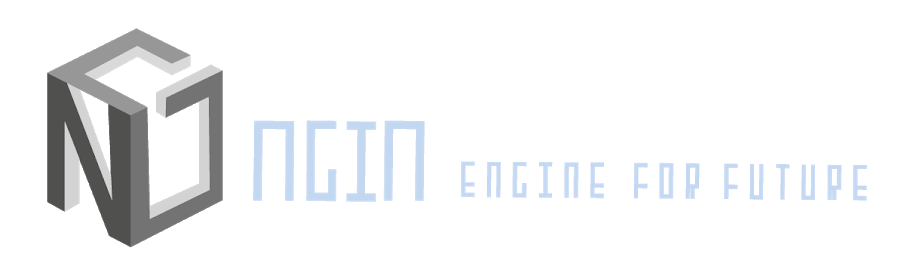

# Ngin: Search Engine Based Ecosystem



Search engine is the core of internet. To hug the new century of blockchain and serve every user, we (four members now) decided to build a new search engine based on blockchain technology, and named it "Ngin" (pronounced as engine).

## Description

### Vision

Google search is the most used search engine on the World Wide Web (WWW) across all platforms. The founders of Ngin want to build one "Google" on the blockchain, but with a clean, untraceable, portable, convenient, ad free, and even profitable features. Due to the transparency of a public blockchain, we will call our community to do more meaningful analysis or AI development based on anonymous data on chain.

### Technical Introduction

In this chain, the work of every miner is acting as a "search engine spider". Also known as Proof of Fetch (PoF), the miner will fetch the page infomation from websites. While running the mining software, everyone will crawl webpage URLs and information from a source URL. The miner can decide on the source URL and that is push to the "pool". After the pool verifies, all the messages are sent to the blockchain. As proof, we should give mining rewards directly to the miners, but the cost to fetch web site is lower than calculating hashes. So, the rewards are sent to the FuncNodes first, and then the FuncNodes distributes to the miners. Miners decide which node to contribute to.

To get rid of scam on pushing, the blockchain system will check every URL page and detail using "pool" nodes. The rule of verification is that the URL & page will be sent to FuncNodes. If consensus is reached by 10 other nodes, the miner will receive reward on the 10th block. Consistently pushing sites and detail to the chain, miners will gain considerable benefit from chain. For more details on our new ecosystem baesd on PoF, please read the "Tech Spec" section.

To start, we chose Proof of Work (PoW) at first to gather more attention and build the community. Gradually, the daemon (ngind) will be replaced with FuncNodes' code. The community asked for a traditional PoW software-infrastructure roadmap. We have published separate mining and mining pool software. All features in PoF will be built after the MasterNode Fork.

For users, who just want to search rather than join project, they can freely search using Google™. For people who want to do more and gain more, they can use our token (gained from mining) to get more advanced search function. What's the search function? For example, history webpage view, searching in a limited time range, more reliable or user-friendly answer, and so on.

Due to the future development of a search engine on blockchain, we **DID NOT** choose to host on any existing public chain. We build our own from the ground up. As a result, it may take a lot more time and capital from our team. We hope to live up to an impossible standard and try our best to produce a new kingdom like Google™.

Also, to be like Google™, we would build more services and provide API for vendors after the mainnet. Everyone would be able to connect to the new blockchain world through our Ngin.

```simple_struct

+-----------------------------+        +-----------------------------+
|  Url & Info Fetch Miner     |        |  Url & Info Fetch Miner     |
+-----------------------------+        +-----------------------------+
            |                                          |
            |  +------submit with crypto---------------+                           +  +
            |  |                                                                   |  |
+---------------------------+                             +---------------------------+
| Local/Nation Mining Pool  |                             | Local/Nation Mining Pool  |
+---------------------------+                             +---------------------------+
           |                                                            |
           |                          +------verify the result----------+
           |                          |
+--------------+              +--------------+
| (Master)Node | -----mix-----| (Master)Node |
+--------------+              +--------------+
        |                             |                            +-------------+
        |                             |-------provide service----->| User/Vendor |
        |                             |                            +-------------+
+--------------+              +--------------+
| (Master)Node | -------------| (Master)Node |
+--------------+              +--------------+
    |                                      |
    +                                      +
```

### Advantages

What's the advantage of a search engine on blockchain?

1. Truely free, without any tracking or registration required.
2. Ad free. Or you can choose to receive rewards for enabling ads.
3. Cheap advertising service.
4. Rapid decentralized search experience.
5. All messages are encrypted. Keep all details safe.
6. More business development. (Born from an internal project, and will get cooperation with some other traditional company)
7. The change on proof will gain more user and support (PoW -> MasterNodes + PoW -> FuncNodes + PoF)
8. Not scam, official team will always support the project.
9. More services or applications on the base of decentralized search engine. Like AI assistant, cloud IME (Input Tool), Integrated Web Explorer, VPN or Proxy, custom data Analysis... All will be added into roadmap!
10. Equal Distribution, No ICO/Presale, No Premine
11. Get rid of content censorship, search without limitations. 
12. Anyone can visit any where, no bias.
13. Get bonus when valid searching or ads viewing, best choice for users.
14. Browser, Client, RemoteNode... - More than one method to get our service.

### Incentive Mechanism

What's the difference between peer-to-peer (decentralized) application and blockchain application? Not only irreversibility, but blockchain's incentive mechanism, which we called "token".

So, yes, ngin will act as a token, either, and ngin is the only coin/token in our network.

As a coin, ngins are generated from PoW now. In the future, we will add masternodes (MN) to PoW. Lastly, migrate from PoW to FuncNodes and Proof of Fetch (PoF). As a token, ngin will take more jobs to incentivize each role in network and also extend the ecosystem with the token Incentive Mechanism.

For example, based on built-in search engine system, we could make a sub engine for paper searching and even downloading. As everyone know, the paper downloading is not free for commercial usage. Every organization cannot provide a legal free channel to download paper. But we can do commercial collaboration with them and let users pay ngin for the download. Most people can get the paper they want with neglible cost, and as the vendor, the paper provider will gain benefit. Uploading papers is not only availableto vendors, but everyone can uplaod papers and benefit.

Not only the paper/article searching, but goods searching, Q&A service, more and more area including search element. Ngin Network is much more powerful and universally applicable than we imagine.

### Backend Detail

The main Ngin backend program is called ngind (means Ngin Daemon). It is a fork of geth. As the result, all interfaces like JSONRPC and Web3 are similar to Ethereum™. So, if we need to convert the ethereum components to ngin components, such as contracts, we just need to change all web3 methods `eth` prefix to `ngin`.

Some may think changing eth to ngin is unnecessary. Why must we need to modify? We will do a totally new fork of geth, so almost all component, like the JSONRPC module, will be replaced by our version. Also, it is meaningful to let  users realize that we are ngin rather than Ethereum™ to promote our ngin brand.

To reiterate, ngin contains almost all ethereum features:
- Short block time,
- fully decentralization,
- smart contracts,
- relatively transparent transactions.  

## Tech Spec

What's are the components of Search Engine?

### Spider (Fetch & Update)

Spider Technology Architecture:

Spider will follow the Proof of Fetch. Similiar to PoW, PoF will introduce two working method to the Spider Func.

First is the Peer to Peer, aka p2p. As we know, the blockchain is constituted with lots of equal nodes. For one node, the other node act as its peer. When a node/spider fetch a new/updated website info, it will format it and compress it into a msg. The msg will flow from one to another to make itself checked by most nodes. After that, all nodes' database will appended the msg.

But as we known, a pure p2p network has some disadvantage: long delay, waste bandwidth... So like pool-miner in PoW, our PoF has Master-Slave Architecture.

What's the Master-Slave Architecture? Almost all search engine work in this architecture! In that, the Fetch task will be divided into different part. For example, the Slave will download raw data, and the Master will do more on data format and assign small tasks to slaves, even manage database and make indexes.

Finally, combine the two. We can get a more powerful structure.

```PoF_structure

+--------------------+
| Miner(SlaveSpider) |----+
+--------------------+    |                                                                                +---------
                          +---------+--------------------+                       +--------------------+----+
+--------------------+              | Pool(MasterSpider) |----------...----------| Pool(MasterSpider) |
| Miner(SlaveSpider) |--------------+--+-----------------+                       +--------------------+----+
+--------------------+                 |      |           \                    /           |               |
                                       |      |                                            |               +---------------
+--------------------+                 |      .                                            .
| Miner(SlaveSpider) |-----------------+      .                                            .
+--------------------+                        .     GOAL: Add latest data into storage     .
                                              |                                            |
+--------------------+                        |                                            |
| Miner(SlaveSpider) |----+                   |                                            |              +---
+--------------------+    |                   |           /                     \          |              |  
                          +---------+--------------------+                       +--------------------+---+
+--------------------+              | Pool(MasterSpider) |----------...----------| Pool(MasterSpider) |
| Miner(SlaveSpider) |--------------+--+-----------------+                       +---------+----------+----------
+--------------------+                 |                                                   |
                                       |                                                   |
+--------------------+                 |                                                   +-----------------
| Miner(SlaveSpider) |-----------------+
+--------------------+

```

### Index

Search Engine need to get a result from database with the query. It looks same to most website do, but in actual, the Search Engine require more. If you simply use the RDMS like MySQL, MsSQL, the speed of locating the keywords in query will be quite slow - because there is no index on full-text. To speed up, it is a basic knowledge that we need to make a PostingList.

The PostingList, the inverted index data structure, is a central component of a typical search engine indexing algorithm. A goal of a search engine implementation is to optimize the speed of the query: find the documents where word X occurs. Once a forward index is developed, which stores lists of words per document, it is next inverted to develop an PostingList. Querying the forward index would require sequential iteration through each document and to each word to verify a matching document. The time, memory, and processing resources to perform such a query are not always technically realistic. Instead of listing the words per document in the forward index, the PostingList data structure is developed which lists the documents per word.

With the PostingList created, the query can now be resolved by jumping to the word ID (via random access) in the PostingList.

In pre-computer times, concordances to important books were manually assembled. These were effectively PostingLists with a small amount of accompanying commentary that required a tremendous amount of effort to produce.

### Search

[WIP: Our PageRank?]

[WIP: More Algo on Search]

[WIP: Decentralized Search Tasks]

## Plans

### Based on Elastic Integrated framework

Elastic(Lucene) + connector(e2eBridge) + ngind(contract)

ElasticSearch(Elastic) is a search engine based on Lucene library. It provides a distributed, multitenant-capable full-text search engine with an HTTP web interface and schema-free JSON documents. Elasticsearch is developed in Java and is released as open source under the terms of the Apache License. According to the DB-Engines ranking, Elasticsearch is the most popular enterprise search engine followed by Apache Solr, also based on Lucene.

In this solution, Elastic act as a search engine & local database storage solution providor. And the ngin network just acts as the data conveyor.  

```Network

+--------------------------+
| Elastic.Cluster_1.Master |
+--------------------------+
     |          +-----------+          +-------+
     +--------->| connector |--------->| ngind |
                +-----------+          +-------+
                                           |
     +-----------------------------------------+   +-------+    +-----------+
...--|              Blockchain                 |---| ngind |<---| connector |
     +-----------------------------------------+   +-------+    +-----------+
         |                                                          |
     +-------+   +-----------+                             +-------------------------+
     | ngind |<--| connector |                             | Elaster.Cluster_1.Slave |
     +-------+   +-----------+                             +--------------------------+
                    |
+--------------------------+
| Elastic.Cluster_2.Master |
+--------------------------+

```

```Service_request


            +----------------- +        +--------------------------+     +--------------------------+
--request-->| Service Provider |------->| Elaster.Cluster_1.Master |---->| Elaster.Cluster_1.Slaves |
            +------------------+   |    +--------------------------+     +--------------------------+
                                   |
                                   |    +------------------------- +
                                   |--->| Elaster.Cluster_2.Master |...
                                   |    +--------------------------+
                                   |
                                   |    +------------------------- +
                                   |--->| Elaster.Cluster_3.Master |...
                                   |    +--------------------------+
                                   .
                                   .
                                   ....
                                   .
```

### Totally New Design in golang (on the basic of ngind)

Half-done from an internal project.

In this solution, all part will be made on our control. and ngin network will not only work as the data conveyor but do decentralized index, searching tasks. Now our internal project is not a blockchain solution but a simple solution for in-site search, but it's portable, scalable, accurate and powerful. We will develop it based on blockchain design and decenteralization idea, extending its ability on service handing capacity, making it combined with current ngind(fork of geth), to get a general internet web search engine.

```WIP
[WIP]
```

## FuncNodes Types & Rewards: (with different rewards)

### Plan #1

Server:

```list
Elastic: Do full-content search based on blockchain database --------------------------------------------------- much
Pool: update the data ------------------------------------------------------------------------------------------ medium
Host: Do web-based search service ------------------------------------------------------------------------------ little
Minimal: online required, data sync ---------------------------------------------------------------------------- little
```

User:

```list
Miner: Add instance into blockchain ---------------------------------------------------------------------------- medium
Search User: get little reward when they do click (if ads exist) ----------------------------------------------- little
```

### Plan #2

```list
Miner ---------------------------------------------------------------------------------------------------------- medium
NodeHolder(ngind) ---------------------------------------------------------------------------------------------- medium
PoolNodeHolder(ngind+ngPool) ----------------------------------------------------------------------------------- large
```

## FAQ

### How do team get benefit from this project

1. diff between posting ads' price and reading ads' reward.

2. Professional in-site search/analysis services providing.

3. Future peripheral products like AI-Assistant.

NOTICE: dev funds is for ngin's develop and market, will not be used for benefit

### Why don't choose DApp

DApp used to be our choose.

But now it is canceled, because we can not rely on other's chain/ecosystem. Though masternode is no problem on ETH/EOS's chain, but what if FuncNode? what if PoF's spiders & pools? As the result, We think using our public chain would be more free and flexible.

### Why don't choose Token

We are not a finished project, and we dont like excessive marketing without any resource. And some teammates wanna be anonymous. Token is not a good choice.

And We need getting growth with our community. So the road of a Coin is satisfy the needs of us.

### Temporary Algorithm - M00N

As you know, now we are generating blocks based on Proof of Work. So we need an algorithm to achieve that.

As the result, M00N was born. M00N is an algorithm which frequently change its built-in sub-algorithm.

M00N is a variant of cryptonight, but it takes only 1MB for scratchpad. Besides variant codes on , M00N adds different algorithm into the last "Select hash" step. The default for cryptonight is `0=BLAKE-256 [BLAKE], 1=Groestl-256 [GROESTL], 2=JH-256 [JH], and 3=Skein-256 [SKEIN].`, current version of M00N adds `BMW` algo. And in future the sub-algorithm will be added, replaced, or removed when necessary fork.

```algo_process
// Part of CryptoNight Paper
                                  |
                                  V
                            +----------+
                            | Keccak-f |
                            +----------+
                             |    |
                 +-----------+    |
                 |                |
                 V                V
          +-------------+  +-------------+
          | Select hash |->| Chosen hash |
          +-------------+  +-------------+
                                  |
                                  V
                          +--------------+
                          | Final result |
                          +--------------+
```

When necessary? In our plan, ngin should be mined equally on every machine. So we dislike the GPU mining and make ngin's mining cpu-only. We will start fork when GPU mining appearing. Or there need to change/test some new feature, we will also start a necessary fork.

### Fork from

Yes, we are ETC fork. Though it appears that ETH is much more powerful, but ETH takes too much historical burden which block us developing.  

### Ngin Specs

```specs
Name: Ngin
Ticker: NG
Consesus Algo: M00N
Block Time: ≈ 13 sec
Era Length: 100,000 blocks (~2 weeks)
Total Block Reward: ≤ 10 NG
Total Supply: ≈ 360,000,000 NG
P2P Port: 52520
RPC Port: 52521
WS Port: 52522
Premine: NO
Presale/ICO: NO
Smart Contract Standards: ERC-20, ERC-223
```

### Block Reward

As above, the Total Block Reward is 10 NG. But it's only in Era #0 that each block reward is 10 NG, there is coefficient to calculate the reward in other era.

$MaxReward = 10$

$Coefficient = \frac{249}{250}$

$BlockReward(EraNum) = Coefficient^{EraNum}MaxReward$

### Circulating Supply

$EraLen = 100000$

$CirculatingSupply(EraNum) = \sum{i=0}^{EraNum}{EraLen*BlockReward(EraNum)}$

## Community

[](https://discord.gg/xxr748Y)

[Twitter @NginProject](https://twitter.com/NginProject)
